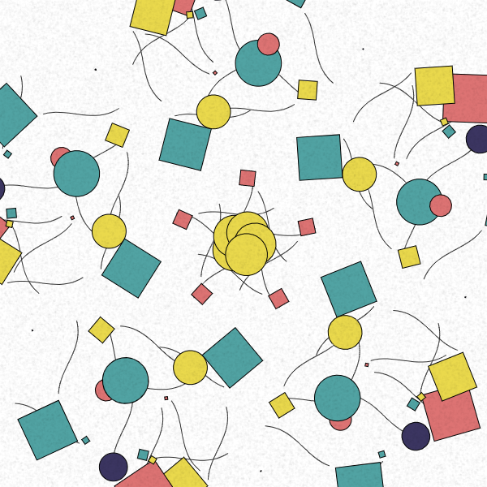

# p5js-sketches
## A Repository for my p5.js sketches

### Sketches:

#### [Kaleidoscope](https://marceloprates.github.io/p5js-sketches/kaleidoscope/)

#### [Pencil Drawing](https://marceloprates.github.io/p5js-sketches/pencil_drawing/)

#### [Abstract 27/05/20](https://marceloprates.github.io/p5js-sketches/abstract_27_05_20/)

#### [Bubbles](https://marceloprates.github.io/p5js-sketches/bubbles/)

