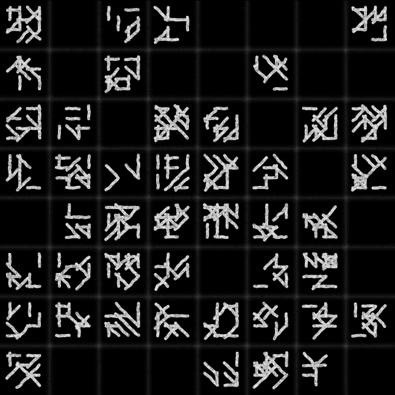
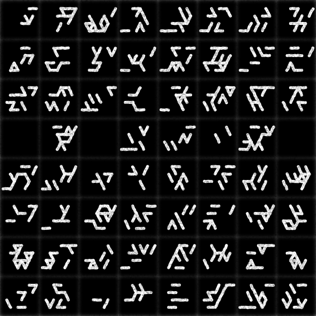

# p5js-sketches
## A Repository for my p5.js sketches

### Template for exporting sketches as perfectly looping gifs

#### [Template](https://marceloprates.github.io/p5js-sketches/template/)

### Sketches:

#### [Kaleidoscope](https://marceloprates.github.io/p5js-sketches/kaleidoscope/)

#### [Pencil Drawing](https://marceloprates.github.io/p5js-sketches/pencil_drawing/)

#### [Abstract 27/05/20](https://marceloprates.github.io/p5js-sketches/abstract_27_05_20/)

#### [Bubbles](https://marceloprates.github.io/p5js-sketches/bubbles/)

#### [Abstract 23/05/20](https://marceloprates.github.io/p5js-sketches/abstract_23_05_20/)

#### [Abstract 01/07/20](https://marceloprates.github.io/p5js-sketches/abstract_01_07_20/)

#### [Shadow](https://marceloprates.github.io/p5js-sketches/shadow/)

#### [Circle Packing](https://marceloprates.github.io/p5js-sketches/circle_packing/)

#### [Abstract 04/07/20](https://marceloprates.github.io/p5js-sketches/abstract_04_07_20/)

#### [Abstract 09/07/20](https://marceloprates.github.io/p5js-sketches/abstract_09_07_20/)

#### [Windows 3000 Loading Screen](https://marceloprates.github.io/p5js-sketches/windows_3000_loading_screen/)

#### [Abstract 11/07/20 - 1](https://marceloprates.github.io/p5js-sketches/110720_1/)

#### [Abstract 11/07/20 - 2](https://marceloprates.github.io/p5js-sketches/110720_2/)

#### [Glyphs](https://marceloprates.github.io/p5js-sketches/glyphs/)

#### [Glyphs - Runes](https://marceloprates.github.io/p5js-sketches/glyphs_runes/)

